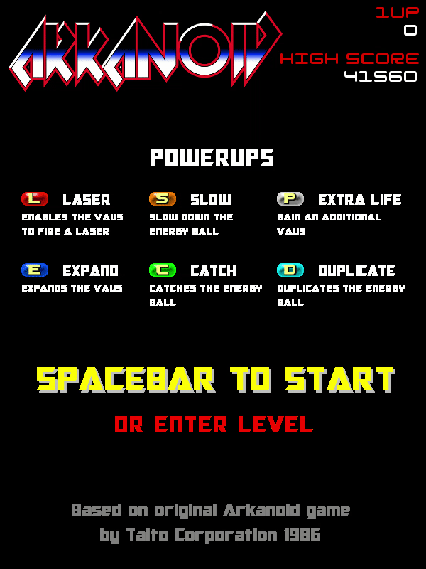
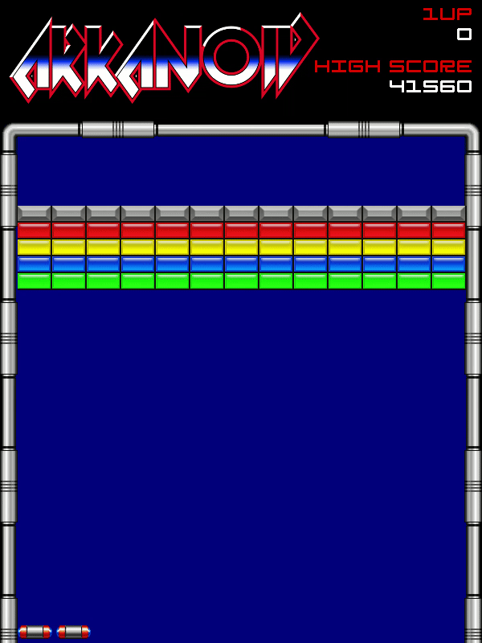
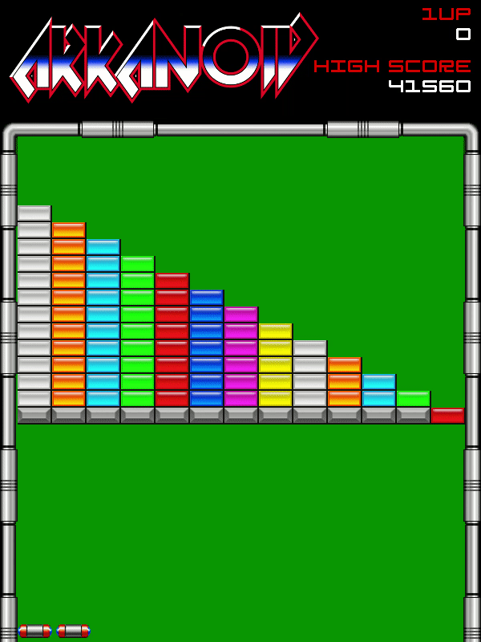
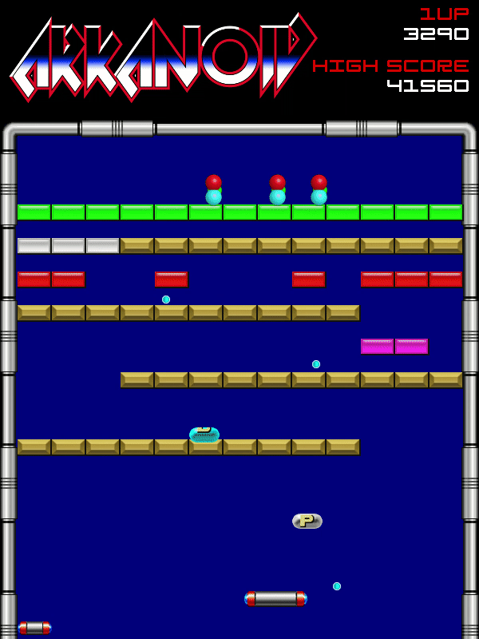
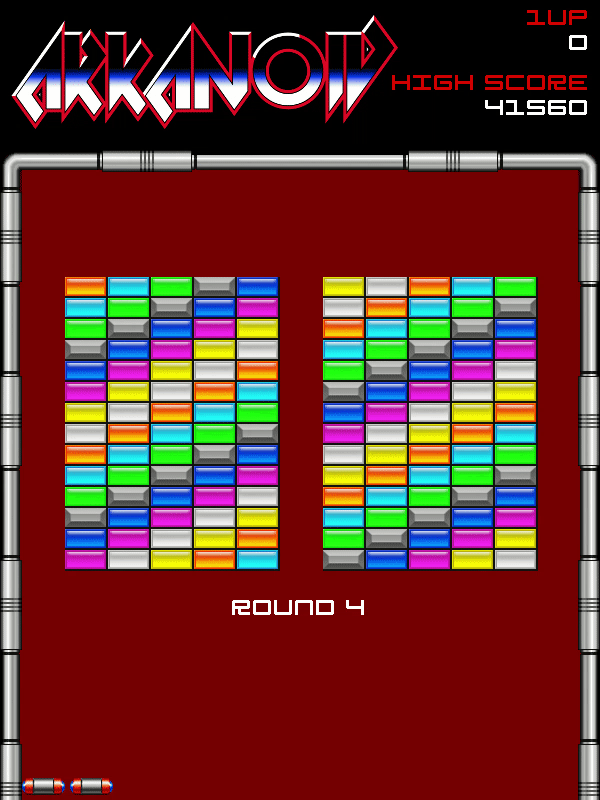

# Replica do Game Arkanoid feita em Python + Pygame
# Classico dos anos 80 e 90 dos consoles Nes e Snes sendo refeito usando Python e Pygame!
# Setas: Controlam o Bloco
# Espaço: Ação
# Imagens do Jogo
# Inicio

# Round 1

# Round 2

# Round 3

# Round 4

